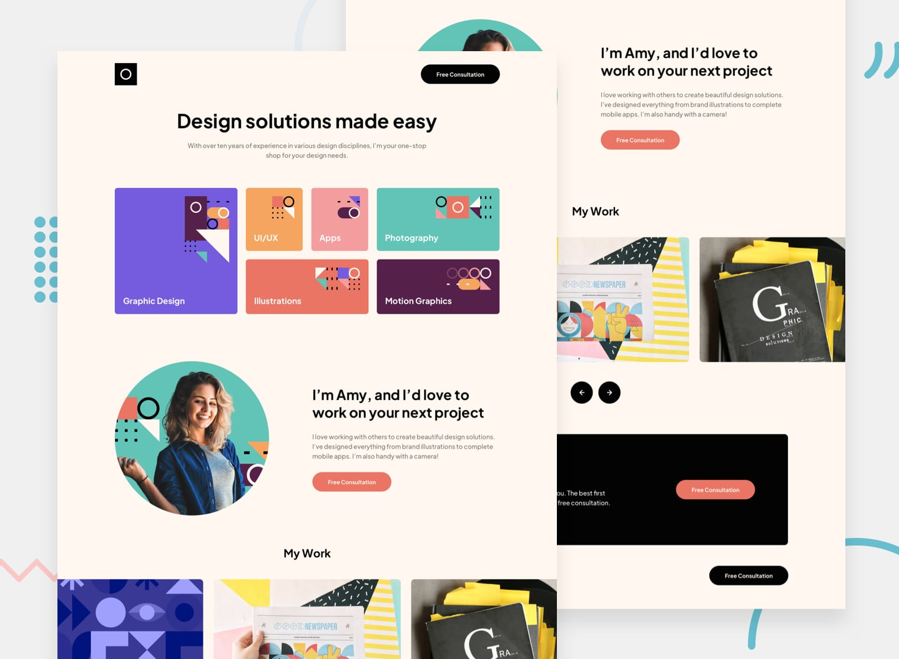

# Single-page design portfolio

### The challenge

Users should be able to:

- View the optimal layout for the site depending on their device's screen size
- See hover states for all interactive elements on the page
- Navigate the slider using either their mouse/trackpad or keyboard

### Screenshot

### Links

- Solution URL: [GitHub Code](https://github.com/beqa200/Single-Page-Design-Portfolio)
- Live Site URL: [GitHub Live](https://beqa200.github.io/single-page-design-portfolio/)

## My process

### Built with

- Semantic HTML5 markup
- CSS custom properties
- Tailwind CSS 
- JS
- Flexbox
- CSS Grid
- Mobile-first workflow

### What I learned

Developed my skills at Tailwind CSS and also learned how to make SlideShow.

## Author

- LinkedIn - [Beqa Maisuradze](https://www.linkedin.com/in/beqa-maisuradze-76a730234/)

